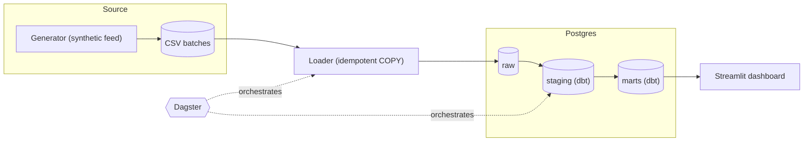

# Transaction Monitoring Data Platform

An end-to-end data engineering project that ingests daily banking transactions, models them in a warehouse, flags suspicious activity with AML-style rules, and measures how good those rules are. Everything runs locally in Docker and uses **synthetic data only**.

<!-- CI badge: after pushing to GitHub, add:
 -->

## What it demonstrates

- **Ingestion:** a simulated source system drops daily CSV batches; an idempotent loader puts them in PostgreSQL.
- **Modelling:** dbt turns raw data into typed staging views and a star schema, with 50 automated data tests.
- **Domain logic:** SQL alert rules for cash structuring and rapid pass-through transfers.
- **Evaluation:** the rules are scored against planted ground truth (precision and recall), and the build fails if quality drops.
- **Orchestration:** Dagster runs everything in dependency order with one partition per day.
- **Delivery:** a Streamlit dashboard, a one-command Docker setup, and a CI workflow.

| | |
|---|---|
| Data | 500 customers, 750 accounts, about 8,400 transactions over 7 days |
| dbt | 13 models (4 staging views, 9 marts tables), 1 seed, 50 data tests |
| Alert rules | Structuring, rapid in/out, high-risk country |
| Stack | Python, PostgreSQL, dbt, Dagster, Streamlit, Docker Compose, GitHub Actions |

## Architecture



| Layer | What it does |
|---|---|
| Generator | Writes one day of transactions per run, plus a separate answer key of planted suspicious cases. Seeded by date, so a day is always reproducible. |
| Loader | Deletes the day's rows, bulk-copies the file in, and commits as one transaction. Re-running a day replaces it. |
| `raw` | Data exactly as received, all text, tagged with `_batch_id` and `_loaded_at`. Never modified. |
| `staging` | Typed, standardised, deduplicated views (one row per key; the latest load wins). |
| `marts` | Star schema (customer, account and date dimensions, a transaction fact), the alert rules, and the evaluation model. |
| Dagster | Asset graph with daily partitions; downstream steps are skipped if an upstream step fails. |
| Dashboard | Reads the marts and staging layers only. |

## Quick start (Docker)

You need Docker Desktop. No `.env` file and no Python install are required.

```bash
docker compose up -d
```

The first run builds the image, then runs the whole pipeline through Dagster inside the container: reference data, one run per day for 7 days, then the dbt build and tests. The command returns once the dashboard container has started, which happens after the data is ready. On later runs the pipeline is skipped because the warehouse is already built.

| What | Where |
|---|---|
| Dagster UI | http://localhost:3000 |
| Dashboard | http://localhost:8501 |
| Postgres (psql, SQL clients) | `localhost:5432`, database `txn_monitoring`, user and password `warehouse` (change the host port with `POSTGRES_PORT` in `.env`) |

```bash
docker compose ps                                          # all three services running
docker compose logs -f dagster                             # follow the pipeline run
docker compose exec dagster python -m orchestration.run_pipeline   # re-run the pipeline
docker compose down                                        # stop, keep data
docker compose down -v                                     # stop and wipe everything
```

If the pipeline fails, the dashboard still starts and shows an error; open the Dagster UI for the failed run's logs. The credentials are throwaway local values.

## Run without the app containers

Postgres still runs in Docker; Python, dbt, Dagster and the dashboard run on your machine.

```bash
python -m venv .venv && source .venv/bin/activate      # Windows: .venv\Scripts\activate
pip install -r requirements.txt -r requirements-dashboard.txt
cp .env.example .env                                   # Windows: copy .env.example .env
docker compose up -d postgres
set -a && source .env && set +a                        # dbt reads environment variables, not .env
```

Then either run the steps by hand:

```bash
python -m data_generator.generate --date 2026-10-01 --days 7
python -m ingestion.load_raw --reference
for d in 2026-10-0{1..7}; do python -m ingestion.load_raw --date "$d"; done
python -m ingestion.load_raw --ground-truth
cd dbt_project && dbt build --profiles-dir . && cd ..
streamlit run dashboard/app.py
```

or let Dagster do it:

```bash
export DAGSTER_HOME="$PWD/.dagster_home" && mkdir -p "$DAGSTER_HOME"
python -m orchestration.run_pipeline
dagster dev -m orchestration.definitions               # UI at http://localhost:3000
```

On Windows Command Prompt, use `set VAR=value` instead of `export`, and loop over the seven dates with `for %d in (2026-10-01 2026-10-02 ... 2026-10-07) do ...`.

Expected result: 7 batches in `raw.transactions`, `PASS=64` from `dbt build`, and the figures in the evaluation table below.

## Data model

```
raw.customers, raw.accounts, raw.transactions, raw.ground_truth
        |
staging.stg_customers, stg_accounts, stg_transactions, stg_ground_truth, high_risk_countries
        |
marts.dim_customer, dim_account, dim_date
marts.fct_transactions
marts.alert_structuring, alert_rapid_in_out, alert_high_risk_country  ->  marts.fct_alerts
marts.eval_alert_performance
```

`fct_transactions` adds a cash flag and the counterparty country's risk level. `fct_alerts` stacks the three alert tables, one row per rule, account and day.

## Alert rules

| Rule | Logic | Refinement (on by default) |
|---|---|---|
| `structuring` | 3 or more cash deposits in one day, each 90-100% of the 10,000 threshold | Ignore accounts that trigger on 3 or more different days (routine for cash-intensive businesses) |
| `rapid_in_out` | Inbound transfer of 10,000 or more, followed within 24 hours by an outbound transfer of 80-100% of it | Outbound leg must go to an elevated- or high-risk country |
| `high_risk_country` | Any activity with a counterparty on the high-risk list | None. A screening rule with no planted answers |

All thresholds are dbt variables in `dbt_project/dbt_project.yml`, for example `dbt build --vars '{structuring_min_deposits: 2}'`.

## Evaluating the rules

The generator plants suspicious cases and writes them to a separate answer key. It also plants **decoys**: legitimate activity that looks suspicious but is not in the key, so alerting on it counts as a false positive.

- Cash-intensive businesses lodging several just-under-threshold deposits (12 do it most days, 5 only occasionally).
- Large inbound transfers forwarded within hours, mostly to domestic accounts and sometimes to CY or AE.

`eval_alert_performance` compares alerts to the key at account-day level. Measured on the 7-day dataset (seed 42; 21 structuring and 28 rapid in/out planted cases):

| Rule | Precision without refinement | Precision with refinement | Recall |
|---|---|---|---|
| `structuring` | 0.273 (56 false positives) | 0.808 (5) | 1.0 |
| `rapid_in_out` | 0.571 (21 false positives) | 0.933 (2) | 1.0 |

Reproduce the unrefined figures with:

```bash
cd dbt_project && dbt build --profiles-dir . --vars '{structuring_recurring_days: 0, rapid_require_risky_outbound: false, min_precision: 0, min_recall: 0}'
```

A dbt test fails the build if precision drops below 0.75 or recall below 0.90. It only applies once at least 7 days are loaded (`gate_min_days`), because the structuring refinement needs several days of history.

**Read these numbers carefully.** The decoys and the refinements were designed together on synthetic data, so they show the tuning workflow works, not how the rules would perform on real bank data. Recall is 1.0 because no planted structurer repeats across days; a real repeat structurer would look like a shop and be suppressed by the refinement.

## Orchestration

Dagster models the pipeline as assets:

```
daily_batch_files -> raw_transactions, raw_ground_truth -> dbt models
raw_customers, raw_accounts ------------------------------^
```

- **Daily partitions:** a fixed 7-day window (2026-10-01 to 2026-10-07). Re-running a day replaces it.
- **dbt in the graph:** every model, seed and test is an asset or check; dbt sources are mapped to the ingestion assets so lineage is one connected graph.
- **Idempotent loads:** each load deletes its batch and re-inserts it in a single transaction, so re-runs never duplicate data and a failure leaves the old data intact.
- **Schedule and sensor:** a daily schedule and a new-file sensor are defined but switched off by default.
- **Manifest refresh:** dbt's manifest is rebuilt automatically when dbt files change.

## Dashboard

Three tabs, with sidebar filters for rule, date range and customer KYC risk:

- **Alerts:** daily trend by rule, plus a table of alerts with each one's outcome (confirmed, false positive, or not evaluated).
- **Rule performance:** precision, recall and the true positive, false positive and missed counts per rule.
- **Investigate:** pick an alert and see the account's transactions the day before, during and after.

## Testing and CI

- **dbt:** 50 data tests (unique and not-null keys, relationships between facts and dimensions, allowed values, positive amounts) plus the precision and recall gate.
- **Python:** unit tests for the generator (reproducibility, unique IDs, ground truth consistency) and a smoke test that the dashboard renders against a built warehouse.
- **GitHub Actions** (`.github/workflows/ci.yml`) runs on every push and pull request against a Postgres service container: lint with ruff, unit tests, generate, load, `dbt build`, source freshness, the dashboard smoke test and Dagster definition validation. A second job builds the Docker image.

```bash
pip install -r requirements-dev.txt
ruff check .
python -m pytest -q
```

## Project structure

```
data_generator/   synthetic data, planted patterns and decoys
ingestion/        idempotent loader for the raw schema
sql/init.sql      schemas and raw tables, created on first Postgres start
dbt_project/      staging, marts, alert rules, evaluation, seed and tests
orchestration/    Dagster assets, jobs, schedule, sensor, container entrypoint
dashboard/        Streamlit app and its queries
tests/            generator unit tests and the dashboard smoke test
.github/          CI workflow
Dockerfile, docker-compose.yml
Makefile          shortcuts for Linux and macOS
```

## Design decisions

- **Synthetic data only**, so the repository is safe to publish.
- **Raw is never modified.** Everything downstream can be rebuilt from it, so fixing a bug means changing SQL and re-running.
- **Files between the generator and the database** mimic how banks hand data to a data team, and let a day be replayed or inspected.
- **Quality is measured, not assumed:** planted cases, decoys and a quality gate.
- **Local first:** nothing depends on a cloud account.

## Limitations

- Small, synthetic and fixed in size (7 days); the performance figures say nothing about real data.
- No incremental dbt models and no cloud deployment.
- Dagster runs steps one at a time in a single process, which is enough at this scale.
- The idempotent loader replaces whole days; it cannot apply partial corrections. The raw tables have no unique constraints, so two simultaneous loads of the same day could duplicate rows, and the staging models keep one row per key as a backstop.
- The schedule and sensor are not running unless you switch them on.
